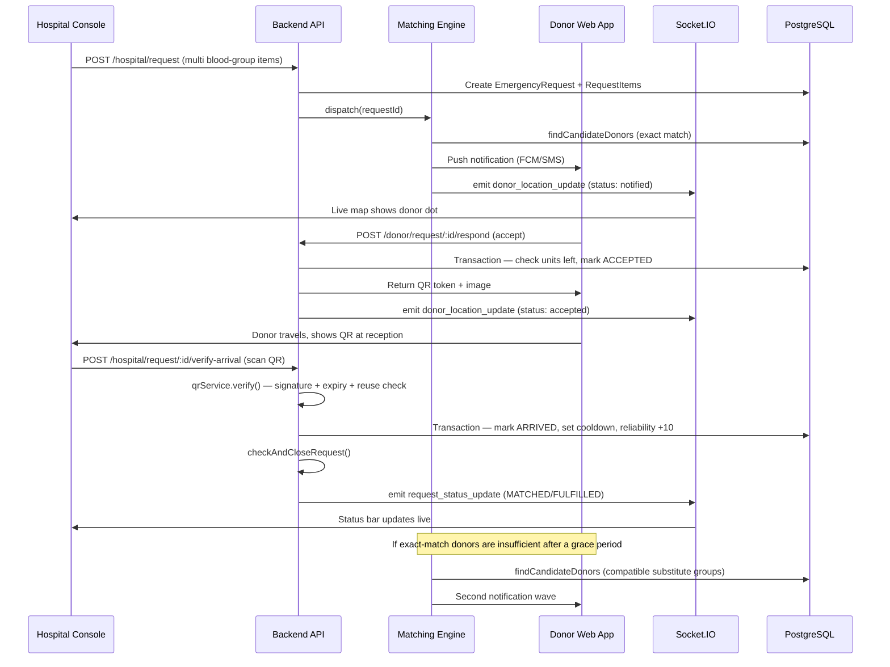

# BloodLink — Emergency Request Flow: Implementation Guide

This document explains how the emergency request lifecycle is implemented in `bloodlink-backend/`, file by file, in the order the system actually executes it. Pair this with `README.md` (features/architecture) and `prisma/schema.prisma` (data model).

---

## Table of Contents

1. [Request Lifecycle Diagram](#1-request-lifecycle-diagram)
2. [File Map](#2-file-map)
3. [Step-by-Step Walkthrough](#3-step-by-step-walkthrough)
4. [Concurrency & Safety Notes](#4-concurrency--safety-notes)
5. [Setup & Run Order](#5-setup--run-order)
6. [Testing Checklist](#6-testing-checklist)
7. [Not Included Yet](#7-not-included-yet)

---

## 1. Request Lifecycle Diagram



---

## 2. File Map

| File | Responsibility |
|---|---|
| `src/server.js` | App entry point — wires Express, Socket.IO, security middleware, cron |
| `src/socket.js` | Live map event broadcasting (`donor_location_update`, `request_status_update`) |
| `src/middleware/auth.js` | JWT verification + role gating (`DONOR` / `HOSPITAL` / `BANK` / `ADMIN`) |
| `src/utils/geo.js` | Haversine distance + bounding-box donor candidate search |
| `src/utils/compatibility.js` | ABO/Rh compatibility matrix for substitute-donor matching |
| `src/services/matchingEngine.js` | Ranks and dispatches donor notifications in waves |
| `src/services/notificationService.js` | FCM push with Twilio SMS fallback |
| `src/services/qrService.js` | Generates and verifies the signed QR handshake token |
| `src/services/requestService.js` | Auto-closes a request once all units are QR-confirmed |
| `src/routes/hospital.routes.js` | `POST /request`, `GET /request/:id`, `POST /request/:id/verify-arrival` |
| `src/routes/donor.routes.js` | `PATCH /availability`, `POST /location`, `POST /request/:id/respond` |
| `src/jobs/noShowCron.js` | Background job penalizing donors who accepted but never arrived |

---

## 3. Step-by-Step Walkthrough

### Step 1 — Hospital creates the request
**File:** `src/routes/hospital.routes.js` → `POST /request`

Validates the payload with Zod, confirms the hospital's `HospitalVerification.status === 'VERIFIED'` (Trust Layer gate — unverified hospitals are rejected with a 403), then creates one `EmergencyRequest` with nested `RequestItem` rows in a single Prisma call so a request can hold several blood groups at once. `matchingEngine.dispatch()` is fired immediately after, without blocking the response.

### Step 2 — Candidate donor search
**File:** `src/utils/geo.js` → `findCandidateDonors()`

Filters donors first with a cheap lat/lng bounding box (fast, indexable), then refines with an exact `haversineKm()` distance check. Only `eligible && isOnline` donors of the target blood group(s) are considered. This is the point where you'd swap in a PostGIS `ST_DWithin` raw query later for larger scale (see the note at the bottom of `schema.prisma`).

### Step 3 — Compatibility fallback
**File:** `src/utils/compatibility.js` → `compatibleDonorGroups()`

A static ABO/Rh lookup table. `matchingEngine.dispatch()` calls this only when the exact-match wave hasn't fully filled a `RequestItem` within the grace period (`WAVE_FALLBACK_DELAY_MINUTES`, default 5 min).

### Step 4 — Rank and notify
**File:** `src/services/matchingEngine.js` → `rankDonors()` + `notifyWave()`

Donors are sorted by distance ascending, then reliability score descending. `notifyWave()` creates a `RequestResponse` row per donor (`status: NOTIFIED`), calls `notificationService.sendPush()`, and emits `donor_location_update` over Socket.IO so the donor's dot appears on the hospital's live map instantly.

### Step 5 — Donor accepts or declines
**File:** `src/routes/donor.routes.js` → `POST /request/:id/respond`

Decline is a simple status update. Accept is wrapped in `prisma.$transaction()`: it re-counts already-`ACCEPTED`/`ARRIVED` responses against `unitsNeeded` inside the transaction before writing, which is what stops two donors from both being accepted for the last unit (see §4). On success, `qrService.generate()` is called immediately and the token/QR image is returned in the same response.

### Step 6 — Live map updates
**File:** `src/socket.js`

Every state change (`notified`, `accepted`, `declined`) emits into the `request:{id}` room. The hospital frontend joins this room via `join_request_room` and simply listens for `donor_location_update` to recolor markers — no polling required.

### Step 7 — QR token generation
**File:** `src/services/qrService.js` → `generate()`

Builds a payload `{ donorId, requestId, nonce, exp }`, signs it with HMAC-SHA256 (`QR_SECRET`), stores the signed string in `QRToken.signedPayload` with a 15-minute expiry, and renders it as a QR image with the `qrcode` package.

### Step 8 — Hospital verifies arrival
**File:** `src/routes/hospital.routes.js` → `POST /request/:id/verify-arrival`, using `qrService.verify()`

Verification checks, in order: signature matches → not expired → token exists in DB → not already used. Any failure returns a specific error code (`INVALID_SIGNATURE`, `TOKEN_EXPIRED`, etc.) rather than a generic failure, which makes debugging the scanner integration much easier. On success, a single transaction marks the token used, sets the response to `ARRIVED`, updates the donor's `lastDonationDate` (starting their cooldown), and increments their reliability score.

### Step 9 — Auto-close the request
**File:** `src/services/requestService.js` → `checkAndCloseRequest()`

Sums `unitsNeeded` across all `RequestItem`s and compares to the count of `ARRIVED` responses. Sets the request to `FULFILLED` or `MATCHED` accordingly and broadcasts `request_status_update` so the hospital's progress bar updates without a refresh.

### Step 10 — No-show handling
**File:** `src/jobs/noShowCron.js`

Runs every 10 minutes via `node-cron`. Any `RequestResponse` stuck at `ACCEPTED` past `NO_SHOW_GRACE_MINUTES` (default 120) is marked `NO_SHOW`, and the donor's reliability score is decremented — this is what feeds back into Step 4's ranking on future requests.

---

## 4. Concurrency & Safety Notes

- **Overbooking prevention:** the accept-path transaction in `donor.routes.js` performs a count-then-write inside `prisma.$transaction()`. Under Postgres's default isolation level this is safe for hackathon-scale concurrent load; if you need to harden it further for high traffic, add a raw `SELECT ... FOR UPDATE` lock on the `RequestItem` row inside the transaction.
- **QR replay protection:** `QRToken.used` is flipped to `true` in the same transaction that marks the response `ARRIVED`, so a second scan attempt of the same code fails at the `TOKEN_ALREADY_USED` check.
- **Notification idempotency:** `notifyWave()` uses `upsert` on `RequestResponse`, so re-running a dispatch (e.g., after a server restart) won't create duplicate rows or double-notify a donor already in `NOTIFIED` state.
- **Stale web presence (donor side is a browser tab, not a native app):** a closed or crashed tab won't reliably fire a "go offline" call, so `findCandidateDonors()` should not trust `isOnline` alone. Add a `lastPingAt` freshness check (e.g., exclude donors whose last ping is older than ~90 seconds) wherever donors are queried, and consider a lightweight cron similar to `noShowCron.js` that flips `isOnline` to `false` for anyone stale, so the live map doesn't show ghost dots.

---

## 5. Setup & Run Order

```bash
npm install
cp .env.example .env        # fill in DATABASE_URL, JWT_SECRET, QR_SECRET
npx prisma migrate dev      # creates all tables from schema.prisma
npm run dev                 # starts Express + Socket.IO + cron on PORT
```

Seed a hospital, mark it `VERIFIED` in `HospitalVerification`, seed a few donors with `isOnline: true` and real lat/lng near the hospital, then hit `POST /hospital/request` to trigger the full flow end-to-end.

---

## 6. Testing Checklist

- [ ] Seed 3+ donors of varying blood groups inside the request radius, 1–2 outside it — confirm radius filtering excludes the far ones.
- [ ] Two donor accounts accept simultaneously on a 1-unit request — confirm the second gets `409 ALREADY_FULFILLED`.
- [ ] Scan the same QR token twice — confirm the second attempt returns `TOKEN_ALREADY_USED`.
- [ ] Manually backdate a `RequestResponse.respondedAt` past the grace window and run `startNoShowJob()`'s query once — confirm the donor's reliability score drops.
- [ ] Raise a request from an unverified hospital — confirm `403 Forbidden`.
- [ ] Request more units than exact-match donors can cover — confirm the compatible-substitute wave fires after the grace period.

---

## 7. Not Included Yet

This implementation assumes the following already exist elsewhere in the codebase (referenced but not built here):

- `/auth/register` and `/auth/login` — issuing JWTs shaped `{ id, role }`.
- `/bank/inventory` — blood bank CRUD (must-have #1 from the brief).
- `/admin/hospitals/:id/verify` — the admin approval endpoint that flips `HospitalVerification.status`.
- Donor-side web screens (React, same app as the other dashboards) for the availability toggle, incoming-request alert, and QR display — using `navigator.geolocation.watchPosition()` for location pings and a Socket.IO client connection kept open for real-time incoming-request alerts.
- Hospital-side QR scanner UI (e.g., a web page using `html5-qrcode`) that calls `verify-arrival`.
- A `lastPingAt` staleness sweep (see §4) so donors who close their tab without triggering `beforeunload` don't linger as falsely "online" in the matching pool.
