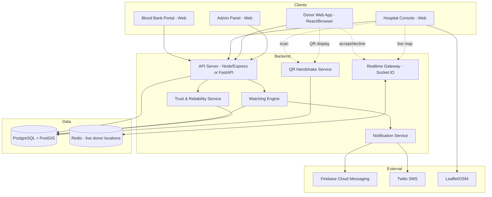

# BloodLink — Real-Time Blood Availability & Donor Network

**Problem Statement:** HT-04 | **Theme:** HealthTech | **Event:** CodeVoyage Hackathon

BloodLink connects blood banks, hospitals, and voluntary donors on one platform. Hospitals raise emergency requests, the system finds and ranks the right donors nearby, donors respond live on a map, and a cryptographic QR handshake confirms the donation actually happened — closing the loop from "request" to "verified fulfillment."

---

## Table of Contents

1. [Core Must-Have Features](#1-core-must-have-features-from-brief)
2. [Standout Features](#2-standout-features-our-differentiators)
   - [Cryptographic QR Handshake](#21-cryptographic-qr-handshake)
   - [Trust & Reliability Layer](#22-trust--reliability-layer)
   - [Smart Multi-Group Matching Engine](#23-smart-multi-group-compatibility--priority-matching-engine)
3. [Live Rapido-Style Donor Map](#3-live-rapido-style-donor-map)
4. [System Architecture](#4-system-architecture)
5. [Data Model](#5-data-model)
6. [Backend — What to Build](#6-backend--what-to-build)
7. [Frontend — What to Build](#7-frontend--what-to-build)
8. [Tech Stack & Libraries](#8-tech-stack--libraries)
9. [Build Roadmap](#9-build-roadmap-phased)
10. [Security & Privacy Notes](#10-security--privacy-notes)
11. [Future Scope](#11-future-scope)

---

## 1. Core Must-Have Features (from brief)

| # | Feature | Owner Module |
|---|---------|--------------|
| 1 | Blood bank inventory portal (by group + component) | Bank Service |
| 2 | Public search by blood group + location | Search Service |
| 3 | Donor registration + eligibility check | Donor Service |
| 4 | Emergency request → notify → accept flow | Matching + Notification |
| 5 | Request status tracking (Open/Matched/Fulfilled) | Request Service |
| 6 | Map view of banks and requests | Map Frontend |

These are judged at **30% weight (must-have completion)** — build and fully demo these before touching anything below.

---

## 2. Standout Features (our differentiators)

### 2.1 Cryptographic QR Handshake

**What it does:** Once a donor accepts a request, their browser displays an encrypted, time-limited QR code (rendered from a data URL — no native app needed). The hospital scans it at reception to cryptographically confirm arrival, block proxy/fake donations, and auto-update the donor's cooldown date — all in one action.

**How it works:**
1. On acceptance, backend generates a signed token: `{donor_id, request_id, issued_at, expires_at, nonce}`.
2. Token is signed with **HMAC-SHA256** using a server-side secret (or issued as a short-lived JWT).
3. Token is rendered as a QR code on the donor's screen (valid ~15 minutes).
4. Hospital reception scans it with a simple camera-based scanner (web page or tablet).
5. Backend endpoint verifies: signature valid → not expired → not already used → donor/request match.
6. On success: marks `arrived = true`, decrements `units_needed`, sets donor's `last_donation_date = now()` (starts their cooldown), and increments their reliability score.
7. Token is marked `used` — replay attempts are rejected.

**Why it stands out:** Solves a real fraud vector (proxy donation, fake "accepted" claims) that no other team is likely to address, and directly satisfies the "privacy/safety considerations" judging criterion.

---

### 2.2 Trust & Reliability Layer

**What it does:** Two connected sub-systems that make the whole platform trustworthy instead of just functional.

**A. Hospital Verification**
- New hospitals register and upload a registration document.
- Status: `pending → verified / rejected`, reviewed by an admin.
- Only `verified` hospitals can raise emergency requests — this prevents spam/fake emergencies from flooding donors.

**B. Donor Reliability Score**
- Every donor starts at a neutral score (e.g., 100).
- **QR-confirmed arrival** → score increases, `completed_count += 1`.
- **Accepted but never arrived** (checked by a background job against a time window, e.g. 2 hours past acceptance) → score decreases, `no_show_count += 1`.
- This score feeds directly into the Matching Engine (§2.3) — reliable donors get notified first.

**Why it stands out:** Turns BloodLink from a one-shot matching tool into a self-improving system, and gives judges a concrete answer when they ask "how do you prevent abuse?"

---

### 2.3 Smart Multi-Group Compatibility & Priority Matching Engine

**What it does:** A hospital request isn't limited to one blood group — it can list several groups with different unit counts in a single request (e.g., "3 units O+, 2 units AB−"). The engine:

1. For each requested group, first searches for **exact matches** among eligible, available donors.
2. If insufficient donors respond within a time window, automatically expands to **compatible substitute groups** using the standard ABO/Rh compatibility matrix (e.g., O− donors are notified for any group, AB+ recipients can accept from any group).
3. Ranks all candidate donors by: `distance (asc) → reliability score (desc) → eligibility freshness (asc)`.
4. Sends notifications in prioritized waves rather than all at once, so the most reliable/closest donors get first shot — reducing wasted "false accepts" from unreliable or far-away donors.
5. Tracks fulfillment per blood-group line item, not just per request as a whole (`units_needed` vs `units_fulfilled` per item).

**Why it stands out:** Real emergencies rarely need just one blood type. Most competing teams will build single-group matching — a multi-group, compatibility-aware, reliability-ranked engine is a genuine technical-depth differentiator (worth 25% of judging).

---

## 3. Live Rapido-Style Donor Map

**The experience:** When a hospital opens an active emergency request, they see a live map exactly like a ride-hailing app:
- **Hospital = one large, distinct pulsing marker** (e.g., a hospital-cross icon) at the center.
- **Donors = small colored dots** scattered around it, color-coded by blood group, similar to how Rapido shows nearby cabs.
- Dots update their state live: `grey = notified`, `blue = viewed`, `green = accepted / en route`, `gold ring = arrived (QR confirmed)`, `faded = declined/expired`.
- Tapping a dot shows: blood group, distance, reliability score, current status.

> **Web architecture note:** the donor side of BloodLink is a fully web application (React, same stack as the other dashboards) — not a native or Flutter mobile app. This changes how "presence" and notifications work, noted inline below.

**How to build it:**

1. **Donor "Available Now" toggle** (like a driver going online in Rapido): when ON, the donor's browser tab uses `navigator.geolocation.watchPosition()` and pings `POST /donor/location` every 30–60 seconds with `{lat, lng}`. When OFF (or after a timeout, e.g. 2 hours), pings stop. Add a `beforeunload`/`visibilitychange` handler that calls `PATCH /donor/availability {status:'offline'}` when the tab closes or backgrounds — but see the staleness note below, since this handler isn't guaranteed to fire on a crash or forced close.
2. **Backend live store:** maintain an in-memory (or Redis) map of `donor_id → {lat, lng, blood_group, status}` for all currently-online donors. Redis is preferable if you want this to scale past a demo.
3. **Staleness fallback (web-specific):** because a browser tab can disappear without warning, don't trust the `isOnline` flag alone. Treat any donor whose `lastPingAt` is older than ~90 seconds (roughly two missed pings) as effectively offline when building the candidate pool, even if `isOnline` is still `true` in the DB.
4. **Scoped visibility:** when a hospital opens a request, the backend runs a PostGIS radius query to find eligible donors around the hospital's location, and subscribes the hospital's browser to a **WebSocket room** (`request:{id}`).
5. **Realtime updates:** any donor location/status change in that room is broadcast (`donor_location_update`) so the map updates without polling.
6. **Frontend rendering:** Leaflet (or Mapbox GL) with custom marker icons — a large pulsing icon for the hospital, small circular markers for donors, colored per blood group and re-styled per status.
7. **Privacy safeguard:** show only a fuzzed location (snapped to the nearest ~250m grid cell) until a donor accepts; reveal a more precise pin only after acceptance, and only to the hospital that raised that specific active request — never publicly.
8. **Notification channel priority:** since a web tab can't reliably receive push while fully closed the way a native app can, treat **Socket.IO (while the tab is open) + SMS as the primary alert channel**, with Web Push (via a Service Worker + VAPID keys) as a best-effort bonus rather than the main path.

**Why it stands out:** This is the single most "wow" visual moment in your demo video — judges immediately understand it because everyone has used a ride-hailing app. It also gives your Matching Engine (§2.3) a visible, tangible payoff instead of being invisible backend logic.

---

## 4. System Architecture



> All four clients — Bank Portal, Hospital Console, Donor App, and Admin Panel — are web apps sharing one React codebase and one deployment pipeline. There is no separate mobile build.

---

## 5. Data Model

```
BloodBank        { id, name, location(lat,lng), address, contact, verified }
Inventory        { bank_id, blood_group, component, units_available, last_updated }

Hospital         { id, name, location(lat,lng), contact, verified }
HospitalVerification { hospital_id, doc_url, status[pending/verified/rejected], reviewed_by, reviewed_at }

Donor            { id, name, phone, blood_group, location, last_donation_date, eligible }
DonorAvailability{ donor_id, is_online(bool), last_ping_at, current_lat, current_lng }
DonorReliability { donor_id, completed_count, no_show_count, score }

EmergencyRequest { id, hospital_id, urgency, radius_km, status[open/matched/fulfilled], created_at }
RequestItem      { id, request_id, blood_group, units_needed, units_fulfilled }
RequestResponse  { request_id, donor_id, status[notified/viewed/accepted/declined/arrived], timestamp }

QRToken          { token_id, donor_id, request_id, signed_payload, expires_at, used(bool) }
```

---

## 6. Backend — What to Build

### Modules

1. **Auth Service** — JWT-based auth, roles: `donor / hospital / bank / admin`.
2. **Bank Inventory Service** — CRUD on inventory per bank.
3. **Search Service** — PostGIS nearest-bank-with-stock query.
4. **Donor Service** — registration, eligibility calculation, availability toggle, location pings.
5. **Hospital Request Service** — create multi-group requests, track status per item.
6. **Matching Engine** — compatibility matrix + reliability-ranked donor search + wave notifications.
7. **Notification Service** — abstraction over FCM (push) and Twilio (SMS fallback).
8. **QR Handshake Service** — token generation, signing, and scan-verification.
9. **Trust & Reliability Service** — hospital verification workflow + donor scoring + no-show cron job.
10. **Realtime Gateway** — Socket.IO rooms per active request, broadcasting location/status updates.
11. **Admin Service** — approve/reject hospitals, view reports.

### Example API Endpoints

```
POST   /auth/register
POST   /auth/login

GET    /search?blood_group=&lat=&lng=

POST   /bank/inventory
GET    /bank/inventory

POST   /donor/register
PATCH  /donor/availability          { status: online|offline }
POST   /donor/location              { lat, lng }               (while online only)

POST   /hospital/request            { items: [{blood_group, units}], radius_km, urgency }
GET    /hospital/request/:id
POST   /donor/request/:id/respond   { action: accept|decline }
GET    /donor/request/:id/qr-token
POST   /hospital/request/:id/verify-arrival   { token }

POST   /admin/hospitals/:id/verify

WebSocket events:
  join_request_room
  donor_location_update
  request_status_update
```

### Background Jobs
- **No-show checker** (cron, e.g. every 10 min): scans `RequestResponse` where `status = accepted` and `now() - timestamp > threshold`, marks `no_show`, decrements donor reliability score.
- **Eligibility refresher**: recomputes `eligible` flag daily based on `last_donation_date`.

---

## 7. Frontend — What to Build

- **Blood Bank Portal:** inventory grid, editable per group/component.
- **Hospital Console:** multi-group request form, live map (§3), fulfillment progress bars per requested group, QR scanner page (camera-based, e.g. `html5-qrcode`).
- **Donor Web App:** registration, availability toggle (browser Geolocation permission prompt), incoming-request full-screen alert delivered over the open Socket.IO connection (Accept/Decline), QR display screen (`` — no native rendering needed), personal stats (donations, reliability score). Keep the donor's Socket.IO connection alive for as long as the tab is open and the availability toggle is on.
- **Admin Panel:** pending hospital verifications, platform-wide stats.

All four are pages/routes in the same React app — donors don't need a separate build, app store listing, or install step, which is a real usability win to mention in your pitch (zero-friction onboarding).

---

## 8. Tech Stack & Libraries

| Layer | Choice | Purpose |
|---|---|---|
| Backend framework | Node.js + Express (or FastAPI) | REST API |
| Database | PostgreSQL + **PostGIS** | Geo-radius queries in one SQL call |
| Cache / live state | Redis | Live donor locations, pub/sub for scale |
| Realtime | Socket.IO | Live map + status updates |
| Auth | `jsonwebtoken`, `bcrypt` | JWT auth + password hashing |
| QR generation | `qrcode` (npm) | Render QR on donor screen |
| QR verification | HMAC-SHA256 (via `crypto` / `jsonwebtoken`) | Signed, time-limited tokens |
| QR scanning (web) | `html5-qrcode` | Camera-based scan at hospital reception |
| Push notifications | Firebase Admin SDK (FCM) or Web Push | Best-effort; reliable mainly while the donor's tab is open — see §3 |
| SMS fallback | Twilio SDK | Primary alert channel when a donor's tab isn't open |
| Scheduled jobs | `node-cron` | No-show detection, eligibility refresh |
| Validation | `zod` or `express-validator` | Request payload validation |
| Frontend (dashboards) | React + Vite + TailwindCSS | Bank/Hospital/Admin UIs |
| Map | Leaflet + `react-leaflet` (OpenStreetMap, free) | Live donor/hospital map |
| Data fetching | Axios / React Query | API calls, caching |
| Charts | Recharts | Reports/stats |
| Donor web app | Same React + Vite + TailwindCSS stack as the other dashboards | One unified codebase, no separate mobile build or app-store step |
| Browser geolocation | `navigator.geolocation.watchPosition()` (built-in, no library) | Location pings while the availability toggle is on |
| Optional web push | `web-push` (npm) + Service Worker + VAPID keys | Best-effort notification when the tab is backgrounded (bonus, not primary) |
| Security | HTTPS, `helmet`, `cors`, rate limiting (`express-rate-limit`) | Basic API hardening |

---

## 9. Build Roadmap (phased)

**Phase 1 — Foundation**
Auth, data models, bank inventory CRUD, public search, donor registration + eligibility + availability toggle with basic location ping.

**Phase 2 — Core Emergency Flow**
Multi-group hospital requests, Matching Engine (compatibility + reliability ranking), Notification Service, Realtime Gateway, and the live map rendering (hospital marker + donor dots + live status colors).

**Phase 3 — Trust Layer & Polish**
QR handshake generation + scan verification, reliability scoring + no-show cron, hospital admin-verification flow, then polish for demo: seed realistic test data, record demo video, finalize slides.

> Rule of thumb: don't start Phase 3 until every Phase 1–2 must-have works end-to-end live. Must-have completion is 30% of the score — a broken bonus feature costs you more than a missing one.

---

## 10. Security & Privacy Notes

- QR tokens are short-lived (~15 min), single-use, and HMAC-signed — replay and forgery are rejected server-side.
- Donor location is only shared while the "Available Now" toggle is on, is fuzzed (~250m grid) until acceptance, and is visible only to the hospital of the active request — never public or persisted long-term.
- Browser geolocation requires HTTPS and an explicit permission grant from the donor — design the UI to explain why location is needed before triggering the browser's permission prompt, since a rejected prompt silently breaks the toggle.
- Because a browser tab can close without warning, treat `isOnline` as advisory only; use `lastPingAt` staleness (§3) as the source of truth for whether a donor is really reachable before including them in a match.
- Hospitals must be admin-verified before they can raise requests, preventing fake emergencies.
- All personal data (phone numbers, health-adjacent info) should be clearly flagged in your submission as using synthetic/test data, per the hackathon's data-handling rules.

---

## 11. Future Scope

- National blood-bank inventory integration (e.g., e-RaktKosh-style API) for real bank data.
- IVR/USSD fallback for donors without smartphones.
- Camp/drive organizer module to shift from purely reactive to preventive donor engagement.
- ML-based demand forecasting per blood group and region.
